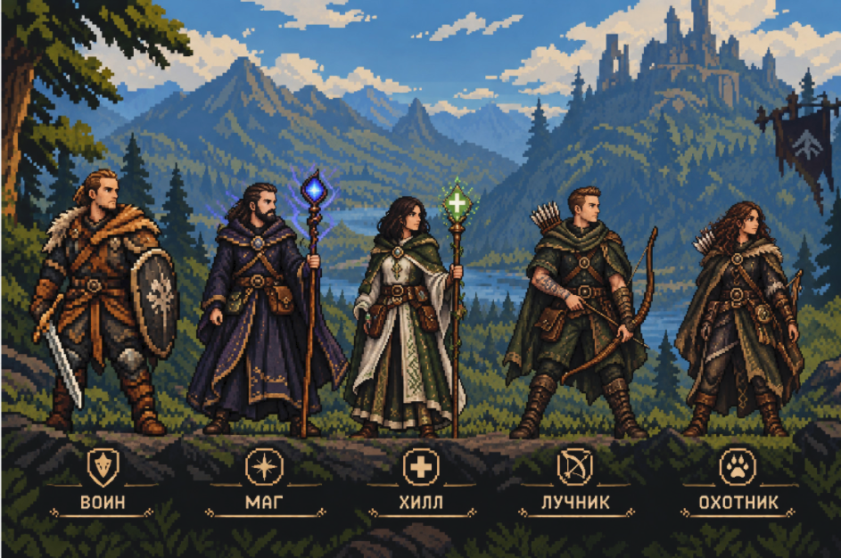
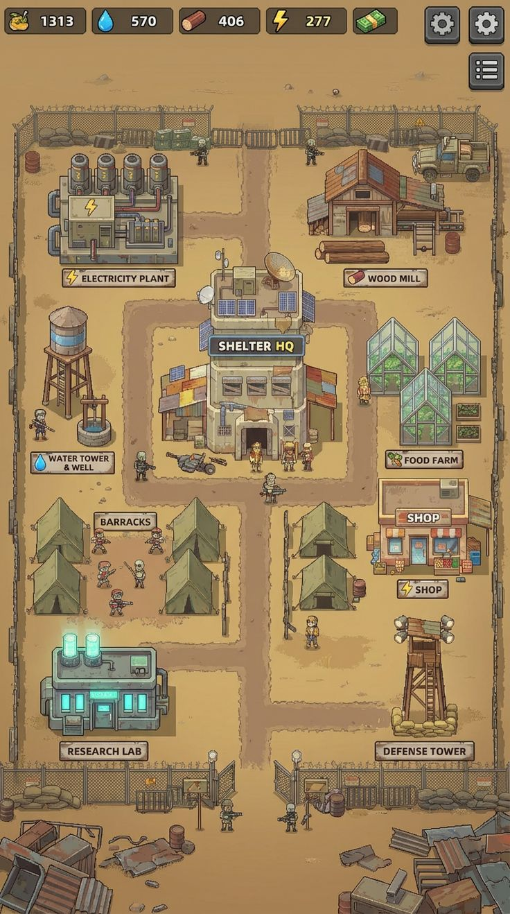

# Pixel Fantasy Survival — ТЗ на графику (MVP)

Документ для художника или для генерации ассетов с последующей доработкой. Референс стиля — `docs/art/reference/heroes_keyart.png`.



## 1. Что берём из референса

- **Сеттинг и настроение:** северное тёмное фэнтези — хвойный лес, горы, озеро, руины замка на скале, приглушённое дневное освещение.
- **Персонажи:** реалистичные пропорции, кожа и мех, ремни и подсумки, бронзовая фурнитура; у каждого класса свой ведущий цвет:

  | Класс | Ведущие цвета | Силуэтная деталь |
  |---|---|---|
  | Воин | коричневая кожа, рыжий мех, сталь | круглый щит, меч |
  | Маг | тёмно-фиолетовый, золотая вышивка | посох с синим кристаллом |
  | Хилл | белый и зелёный, золото | посох с зелёным крестом |
  | Лучник | тёмно-зелёный плащ, кожа | лук, колчан за спиной |
  | Охотник | мех, тёмная кожа, хаки | капюшон с мехом, лук или нож, след лапы |

- **Интерфейс:** почти чёрные тёплые плашки, тонкая бронзово-золотая рамка, светлый «пергаментный» текст, иконки классов — эмблема в круге.

### Чем игровая графика отличается от референса

Референс — постер: высокая детализация, вид сбоку, пиксели не лежат на ровной сетке. Игровые спрайты должны **читаться на телефоне при высоте персонажа около 32 px**. Поэтому нужны: упрощённые силуэты, крупные цветовые пятна, тёмный контур и ровная пиксельная сетка (1 пиксель арта = 1 пиксель файла).

## 1a. Стиль v2 (действующий)

Решение от 2026-10-06 (`docs/decisions/2026-10-06-art-style-v2.md`): содержание — фэнтези с ключарта, **отрисовка и UI — как в `docs/art/reference/style_target_base.png`**.



- **Свет и цвет:** тёплый солнечный день. Земля охристо-оливковая, светлые поляны и утоптанные тропы, никаких холодных тёмных зелёных полей. Цвета персонажей насыщенные, но в тёплом ключе.
- **Контур:** 1 px тёмно-коричневый `#2a1d16` (не чёрный). Внутренние линии — на тон темнее заливки, а не контурным цветом.
- **Заливка:** плоская, 2–3 тона на материал (свет, основной, тень), без дизеринга и шума. Блик — 1–2 пикселя.
- **Формы:** плотные, «игрушечные», вид 3/4: видны фронт и верх объекта. Силуэт читается в 1x.
- **Тени не рисовать в спрайтах** — их рисует код.
- **Палитра:** мастер-палитра v2 до 40 цветов, файл `docs/art/source/master_palette.gpl`.
- **UI** (делается в коде темой): тёмные скруглённые панели с тонкой светлой рамкой, квадратные тёмные кнопки-иконки, светлые таблички-«пергамент» с тёмным текстом. Иконки HUD — белые/светлые глифы с тёмным контуром.

Пункт «Контур» и «Палитра» из раздела 2 ниже заменяются этим разделом.

## 2. Технические требования

- **Экран:** внутреннее разрешение 360×640 (портрет), масштабирование целыми числами, фильтрация nearest. Никакого сглаживания, полупрозрачных краёв и «псевдопикселей» после апскейла.
- **Формат:** PNG RGBA, 8 бит на канал, прозрачный фон, без premultiplied alpha.
- **Палитра:** общая мастер-палитра до 34 цветов (32 основных + 2 приглушённых тона земли), собранная на основе цветов референса; утверждённая версия — `docs/art/source/master_palette.gpl` (основа — `docs/art/palette.json`, цвета UI — `game/scripts/ui/ui_kit.gd`). Палитру утвердить до начала массового производства, сдать файлом `.gpl` или `.pal`.
- **Контур:** тёмный тёплый `#15110e`; допускается выборочный (selective) контур.
- **Свет:** сверху-слева, одинаковый для всех ассетов.
- **Ракурс в игре:** вид сверху под углом (3/4), персонаж смотрит вправо. Влево он зеркалится кодом, поэтому оружие и щит должны нормально выглядеть в отражении.
- **Исходники:** `.aseprite` (или `.psd`) со слоями и тегами анимаций сдаются вместе с PNG.

## 3. Размеры

| Ассет | Размер кадра | Сейчас (плейсхолдер) |
|---|---|---|
| Герой | **32×32** | 16×16 |
| Обычный враг | 24×24 или 32×32 | 16×16 |
| Босс | 64×64 | 32×32 |
| Снаряд (стрела, болт) | 8×8 – 16×16 | 8×8 |
| Иконка предмета | 16×16 | 16×16 |
| Монета | 8×8 | 8×8 |
| Тайл земли | 16×16 | 16×16 |
| VFX удара (дуга) | 32×32 | 32×32 |
| VFX навыка (кольцо) | 64×64 | 64×64 |
| Портрет для меню | 64×112 | вырезан из референса (≈60×104) |
| Эмблема класса | 24×24 | вырезана из референса |
| Иконки кнопок HUD | 24×24 | нет (текст) |

Точка опоры спрайта — **ноги персонажа** в нижней части кадра (по ним идёт сортировка по глубине). Под ногами оставить 1–2 px запаса.

## 4. Анимации и раскладка листов

Один персонаж — один PNG: **строка = анимация, столбец = кадр**; все кадры одного размера, без отступов.

| Строка | Анимация | Кадры | Скорость | Обязательно для MVP |
|---|---|---|---|---|
| 0 | idle | 4 | 6 fps | да |
| 1 | walk | 6 | 10 fps | да |
| 2 | attack | 4–6 | 12 fps | да |
| 3 | hurt | 2 | 12 fps | да |
| 4 | death | 6 | 10 fps | да |
| 5 | cast (навык) | 4 | 10 fps | герой |

Кадр удара в attack (момент нанесения урона) указать отдельно — под него подстраивается логика.

В JSON сущности лист описывается так (код читает его через `SpriteSheet` и проигрывает через `SpriteAnimator`):

```json
"sprite": "res://assets/sprites/characters/warrior.png",
"frame_size": [32, 32],
"animations": {
	"idle": {"row": 0, "frames": 4, "fps": 6},
	"walk": {"row": 1, "frames": 6, "fps": 10},
	"attack": {"row": 2, "frames": 5, "fps": 12, "hit_frame": 2}
}
```

idle и walk зациклены; attack, hurt и cast проигрываются один раз; death останавливается на последнем кадре. Недостающие анимации просто не проигрываются.

## 5. Список ассетов MVP

Приоритеты: **P0** нужно для первой играбельной сборки с финальным артом, **P1** — до релиза MVP.

### Персонажи и враги
| ID в данных | Что | Приоритет |
|---|---|---|
| `character_warrior` | Воин: игровой лист + портрет + эмблема | P0 |
| `enemy_goblin` | Гоблин, ближний бой, с замахом | P0 |
| `enemy_wolf` | Волк, быстрый, бежит прямо на игрока | P0 |
| `enemy_skeleton` | Скелет-лучник, держит дистанцию + стрела | P0 |
| `enemy_slime` | Слизень, медленный, бродит | P1 |
| `enemy_forest_guardian` | Босс «Страж леса»: древесный великан, залп спор/болтов, призыв гоблинов | P0 |

### Окружение
- Лес (`level_forest_01/02`): тайлсет травы 16×16 (4–6 вариаций), декор — ели, кусты, камни, пни, грибы, цветы; граница арены — плотный лес или скалы. **P0**
- Пещера (`level_cave_01`): каменный пол (4–6 вариаций), кости, кристаллы, сталагмиты. **P1**

### Предметы и эффекты
- Золото, зелье лечения, железный меч (иконки 16×16). **P0**
- Удар оружием, кольцо навыка «Тяжёлый удар», попадание, смерть врага (облачко или рассыпание), подбор предмета. **P0/P1**

### Интерфейс
- Плашка панели и кнопка в трёх состояниях (обычная, нажатая, недоступная) в стиле подписей референса, как 9-slice с указанием отступов. **P0**
- Рамки полос HP, XP и босса. **P0**
- Иконки кнопок HUD: атака, навык, рывок, сумка, взаимодействие, пауза. **P0**
- Пиксельный шрифт с кириллицей и латиницей (лицензия на коммерческое использование), размеры 8 / 10 / 12 / 18. **P1**
- Фон главного меню 360×640 или шире (сейчас используется верхняя часть референса). **P1**

### Остальные классы
Решением от 2026-10-06 (`docs/decisions/2026-10-06-playable-characters.md`) играбельны все пять классов. Их листы, снаряды (`arcane_bolt`, `holy_bolt`, `knife`), эффекты (`arcane_blast`, `heal_wave`) и волк-спутник охотника (`sprites/companions/wolf_companion.png`) сгенерированы — см. `docs/art/GENERATED_ART.md`.

## 6. Куда класть файлы

| Что | Путь в репозитории |
|---|---|
| Игровые листы героев | `game/assets/sprites/characters/<id>.png` |
| Враги и боссы | `game/assets/sprites/enemies/<id>.png` |
| Снаряды | `game/assets/sprites/projectiles/` |
| Иконки предметов | `game/assets/sprites/items/<id>.png` |
| VFX | `game/assets/sprites/vfx/` |
| Тайлы и декор | `game/assets/tilesets/` |
| Портреты, эмблемы, меню | `game/assets/ui/portraits/`, `game/assets/ui/class_icons/`, `game/assets/ui/menu/` |
| Исходники (.aseprite) и палитра | `docs/art/source/` |

Имена файлов совпадают с текущими плейсхолдерами — замена 1:1. Если размер кадра или число кадров изменились, поправить `frame_size` и `animations` в `game/data/*.json`, затем прогнать `tools/build.sh test`: валидация проверит, что все пути существуют.

Портреты и эмблемы сейчас нарезаются из референса скриптом `tools/art/import_keyart.gd` по координатам из `tools/art/keyart_regions.json`. Когда придут финальные портреты, их можно положить поверх (скрипт тогда не запускать).

## 7. Приёмка

- [ ] Пиксели на ровной сетке, нет полупрозрачных краёв и следов ресайза.
- [ ] Используются только цвета утверждённой палитры.
- [ ] Силуэт героя отличим от врагов на зелёном фоне при 100 % масштабе (360×640) на телефоне.
- [ ] Все кадры листа одного размера, ноги на одной линии, нет «дрожания» опоры между кадрами.
- [ ] Спрайт нормально выглядит в отражении по горизонтали.
- [ ] Файлы лежат по путям из раздела 6, тесты проходят, игра проверена на устройстве.
- [ ] Права на арт подтверждены. Если референс или ассеты сгенерированы нейросетью, проверить лицензию генератора для коммерческого релиза в сторах.
